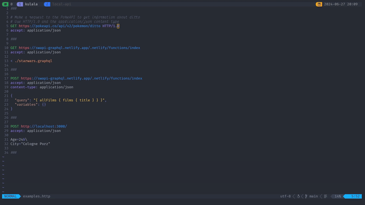

<div align="center">


# kulala.nvim

[](https://github.com/mistweaverco/kulala.nvim/graphs/contributors)
[](https://github.com/mistweaverco/kulala.nvim/releases/latest)
[](https://discord.gg/QyVQmfY4Rt)

[](https://github.com/mistweaverco/kulala.nvim/actions/workflows/tests.yml)
[](https://github.com/mistweaverco/kulala.nvim/actions/workflows/tests.yml)

[Requirements](https://neovim.getkulala.net/docs/getting-started/requirements) • [Install](#install) • [Usage](https://neovim.getkulala.net/docs/usage) • [HTTP File Spec](https://neovim.getkulala.net/docs/usage/http-file-spec) • [Kulala GH Action](https://github.com/mistweaverco/kulala-github-action)

<p></p>

A fully-featured REST Client Interface for Neovim.

Kulala is swahili for "rest" or "relax".

It allows you to make HTTP requests from within Neovim.

<p></p>



<p></p>

## Features
  
Protocols: HTTP, GRPC, GraphQL, WebSocket, Streaming

Specs: HTTP File Spec and IntelliJ HTTP Client compliant

Variables: Environment, Document, Request, Dynamic, Prompt, `http-client.env` files

Importing and running requests from external `*.http` files

Importing and saving request/response data to/from external files

JS and Lua scripting: Pre-request, Post-request, Conditional, Inline, External

Authentication: Basic, Bearer, Digest, NTLM, OAuth2, Negotiate, AWS, SSL

Response formatting and live filtering

Assertions, automated testing and reporting

Built-in LSP completion and formatting

Import/export to/from Postman, OpenAPI, Bruno

CLI tooling and CI hooks

Scratchpad: for making requests

100% Compatibility with IntelliJ HTTP Client

# •

Together with our standalone products [Kulala Language Server](https://github.com/mistweaverco/kulala-ls) and [Kulala Formatter](https://github.com/mistweaverco/kulala-fmt), we aim to provide the best REST Client experience on the web without leaving your favourite editor!

# ••

Kulala team loves feature requests and feedback, so if you have any ideas or suggestions, please let us know!  
We will be happy to implement them ❤️

</div>

## Install

> [!WARNING]
> Requires Neovim 0.10.0+ and cURL.
>
> See [requirements](https://neovim.getkulala.net/docs/getting-started/requirements).

Via [lazy.nvim](https://github.com/folke/lazy.nvim):

### Configuration

```lua
require("lazy").setup({
  {
    "mistweaverco/kulala.nvim",
    keys = {
      { "<leader>Rs", desc = "Send request" },
      { "<leader>Ra", desc = "Send all requests" },
      { "<leader>Rb", desc = "Open scratchpad" },
    },
    ft = {"http", "rest"},
    opts = {
      global_keymaps = false,
      global_keymaps_prefix = "<leader>R",
      kulala_keymaps_prefix = "",
    },
  },
})
```

> [!NOTE]
> By default global keymaps are disabled, change to `global_keymaps = true` to get a complete set of key mappings for Kulala. Check the [keymaps documentation](https://neovim.getkulala.net/docs/getting-started/keymaps) for details.

See complete [configuration options](https://neovim.getkulala.net/docs/getting-started/configuration-options) for more information.

## Honorable mentions

### rest.nvim

For getting this project started.

This project was heavily inspired by the idea of having a REST client in Neovim.

The actual state of [rest.nvim](https://github.com/rest-nvim/rest.nvim)
as archived kicked off the development of kulala.nvim.

### curl.nvim

If you want a simple scratchpad for making HTTP requests,
check out [curl.nvim](https://github.com/oysandvik94/curl.nvim)

It's very different to this project, but it's a great tool for making
HTTP requests from within Neovim and maybe just your cup of tea.

### httpbin.org

For providing a great service for testing HTTP requests and
making it in all the kulala examples.

Thanks for making it easy to test and develop this plugin.

[restnvim-unarchived-post]: https://github.com/rest-nvim/rest.nvim/issues/398#issue-2442747909
