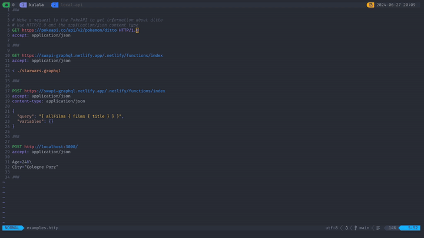

<div align="center">


# kulala.nvim

[](https://github.com/mistweaverco/kulala.nvim/graphs/contributors)
[](https://github.com/mistweaverco/kulala.nvim/releases/latest)
[](https://mistweaverco.com/discord)

[](https://github.com/mistweaverco/kulala.nvim/actions/workflows/tests.yml)

[Requirements](https://neovim.getkulala.net/docs/getting-started/requirements) • [Install](#install) • [Usage](https://neovim.getkulala.net/docs/usage) • [HTTP File Spec](https://neovim.getkulala.net/docs/usage/http-file-spec) • [Kulala GH Action](https://github.com/mistweaverco/kulala-github-action)

<p></p>

A fully-featured 🤏 HTTP/GraphQL/gRPC/Websocket-client 🐼
interface 🖥️ for Neovim ❤️,
that supports the Jetbrains .http spec (with full scripting support).

Kulala is swahili for "rest" or "relax."

It allows you to make HTTP requests from within Neovim.

<p></p>



<p></p>

## Features
  
Protocols: HTTP, gRPC, GraphQL, WebSocket, Streaming

Specs: HTTP File Spec and IntelliJ HTTP Client compliant

Variables: Environment, Document, Request, Dynamic, Prompt, `http-client.env` files

Importing and running requests from external `*.http` files

Importing and saving request/response data to/from external files

JS and Lua scripting: Pre-request, Post-request, Conditional, Inline, External

Authentication: Basic, Bearer, Digest, NTLM, OAuth2, Negotiate, AWS, SSL

Response formatting and live filtering

Assertions, automated testing and reporting

Built-in LSP completion and formatting

Import/export to/from Postman, OpenAPI, Bruno

CLI tooling and CI hooks

Scratchpad: for making requests

100% Compatibility with IntelliJ HTTP Client

# ••

Kulala team loves feature requests and feedback, so if you have any ideas or suggestions, please let us know!  
We'll be happy to implement them ❤️

</div>

## Install

> [!WARNING]
> Requires Neovim 0.12+ and cURL.
>
> See [requirements](https://neovim.getkulala.net/docs/getting-started/requirements).

Via [lazy.nvim](https://github.com/folke/lazy.nvim):

### Configuration

```lua
require("lazy").setup({
  {
    "mistweaverco/kulala.nvim",
    keys = {
      { "<leader>Rs", desc = "Send request" },
      { "<leader>Ra", desc = "Send all requests" },
      { "<leader>Rb", desc = "Open scratchpad" },
    },
    ft = {"http", "rest", "javascript", "lua"},
    opts = {
      kulala_core = {
        -- Optional path to the kulala-core executable
        -- (https://github.com/mistweaverco/kulala-core).
        -- When set, this path is used exclusively.
        -- When nil (default), auto-download and
        -- use kulala-core from GitHub releases based on the user's OS and architecture.
        path = nil,
        -- Subprocess timeout (ms) for kulala-core.
        -- Default is 60000 (1 minute).
        -- nil disables the vim.system timeout.
        timeout = 60000,
        -- Optional override for kulala-core persistence
        -- (cookies, OAuth, prompts).
        -- Default matches kulala-core CLI:
        -- - Linux: ~/.local/share/kulala-core
        --   or $XDG_DATA_HOME/kulala-core
        -- - macOS: ~/Library/Application
        --   or Support/kulala-core
        -- - Windows: %APPDATA%\kulala-core
        data_dir = nil,
        -- Optional override for download url
        download_url = "https://github.com/mistweaverco/kulala-core/releases/download/%s/%s",
      },
      -- dev, test, prod, can be anything
      -- see: https://learn.microsoft.com/en-us/aspnet/core/test/http-files?view=aspnetcore-8.0#environment-files
      default_env = "default",
      -- `"b"` = per-buffer env (default), `"g"` = global
      environment_scope = "b",
      -- enable reading vscode rest client environment variables
      vscode_rest_client_environmentvars = false,

      -- Response body pretty-printing
      response_format = {
        indent = 2,
        expand_tabs = true,
        sort_keys = false,
      },
      ui = {
        -- display mode: possible values: "split", "float"
        display_mode = "split",
        -- split direction: possible values: "above", "right", "below", "left"
        split_direction = "right",
        -- window options to override win_config: width/height/split/vertical.., buffer/window options
        win_opts = { bo = {}, wo = {} }, ---@type kulala.ui.win_config
        -- default view: "body" or "headers" or "headers_body" or "verbose" or fun(response: Response)
        default_view = "body", ---@type "body"|"headers"|"headers_body"|"verbose"|fun(response: Response)
        -- enable winbar
        winbar = true,
        -- Specify the panes to be displayed by default
        -- Available panes are { "body", "headers", "headers_body", "script_output", "stats", "verbose", "report", "help" },
        default_winbar_panes = { "body", "headers", "verbose", "script_output", "report" },
        -- Winbar labels
        winbar_labels = {
          body = "Body",
          headers = "Headers",
          headers_body = "All",
          verbose = "Verbose",
          script_output = "Script Output",
          stats = "Stats",
          report = "Report",
          help = "Help",
        },
        -- show/hide winbar keymaps in labels
        winbar_labels_keymaps = true,
        -- enable/disable variable info text
        -- this will show the variable name and value as float
        -- possible values: false, "float"
        show_variable_info_text = false,
        -- icons position: "signcolumn"|"on_request"|"above_request"|"below_request" or nil to disable
        show_icons = "on_request",
        -- default icons
        icons = {
          inlay = {
            loading = "⏳",
            done = "✔",
            error = "✘",
          },
          lualine = "🐼",
          textHighlight = "WarningMsg", -- highlight group for request elapsed time
          loadingHighlight = "Normal",
          doneHighlight = "String",
          errorHighlight = "ErrorMsg",
        },

        -- enable/disable request summary in the output window
        show_request_summary = true,

        -- do not show responses over maximum size, in bytes
        max_response_size = 32768,

        -- used by `Copy as Curl` command to determine whether to inline request body
        max_request_size = 2048,

        report = {
          -- possible values: true | false | "on_error"
          show_script_output = true,
          -- possible values: true | false | "on_error" | "failed_only"
          show_asserts_output = true,
          -- possible values: true | false | "on_error"
          show_summary = true,

          headersHighlight = "Special",
          successHighlight = "String",
          errorHighlight = "Error",
        },

        -- scratchpad default contents
        scratchpad_default_contents = {
          "@MY_TOKEN_NAME=my_token_value",
          "",
          "# @name scratchpad",
          "POST https://echo.kulala.app/post HTTP/1.1",
          "accept: application/json",
          "content-type: application/json",
          "",
          "{",
          '  "foo": "bar"',
          "}",
        },

        disable_news_popup = false,

        -- enable/disable lua syntax highlighting
        lua_syntax_hl = true,

        -- Settings for pickers used for Environment, Authentication and Requests Managers
        pickers = {
          snacks = {
            layout = function()
              local has_snacks, snacks_picker = pcall(require, "snacks.picker")
              return not has_snacks and {}
                or vim.tbl_deep_extend("force", snacks_picker.config.layout("telescope"), {
                  reverse = true,
                  layout = {
                    { { win = "list" }, { height = 1, win = "input" }, box = "vertical" },
                    { win = "preview", width = 0.6 },
                    box = "horizontal",
                    width = 0.8,
                  },
                })
            end,
          },
        },

        grinch_mode = false, -- disable Xmas greetings
      },

      lsp = {
        ---enable/disable built-in LSP server
        ---@type boolean
        enable = true,

        ---filetypes to attach Kulala LSP to
        ---@type string[]
        filetypes = {
          "http",
          "rest",
          "javascript",
          "typescript",
          "lua",
        },

        ---Only scripts ending in *.http.js, *.http.ts and *.http.lua will be treated as HTTP scripts and
        ---have LSP capabilities, unless `enforce_external_script_naming_convention` is set to false.
        ---This allows users to have non-HTTP scripts with the same filetypes without LSP interference.
        ---@type boolean
        enforce_external_script_naming_convention = true,

        --enable/disable/customize  LSP keymaps
        ---@type boolean|table
        keymaps = false, -- disabled by default, as Kulala relies on default Neovim LSP keymaps

        on_attach = nil, -- function called when Kulala LSP attaches to the buffer
      },

      -- enable/disable debug mode
      debug = 3,
      -- enable/disable bug reports on all errors
      generate_bug_report = false,

      -- set to true to enable default keymaps
      -- (see docs or lua/kulala/config/keymaps.lua)
      -- or override default keymaps as shown in the example below.
      ---@type boolean|table
      global_keymaps = false,
      --[[
        {
          ["Send request"] = { -- sets global mapping
            "<leader>Rs",
            function() require("kulala").run() end,
            mode = { "n", "v" }, -- optional mode, default is n
            desc = "Send request" -- optional description, otherwise inferred from the key
          },
          ["Send all requests"] = {
            "<leader>Ra",
            function() require("kulala").run_all() end,
            mode = { "n", "v" },
            ft = "http", -- sets mapping for *.http files only
          },
          ["Replay the last request"] = {
            "<leader>Rr",
            function() require("kulala").replay() end,
            ft = { "http", "rest" }, -- sets mapping for specified file types
          },
        ["Find request"] = false -- set to false to disable
        },
      ]]

      -- Prefix for global keymaps
      global_keymaps_prefix = "<leader>R",

      -- Kulala UI keymaps; override with custom keymaps as required
      -- (see docs or lua/kulala/config/keymaps.lua)
      ---@type boolean|table
      kulala_keymaps = true,
      --[[
        {
          ["Show headers"] = { "H", function() require("kulala.ui").show_headers() end, },
        }
      ]]

      kulala_keymaps_prefix = "",
    },
  },
})
```

> [!NOTE]
> By default global keymaps are disabled, change to `global_keymaps = true` to get a complete set of key mappings for Kulala. Check the [keymaps documentation](https://neovim.getkulala.net/docs/getting-started/keymaps) for details.

See complete [configuration options](https://neovim.getkulala.net/docs/getting-started/configuration-options) for more information.

## Honorable mentions

### rest.nvim

For getting this project started.

The actual state of [rest.nvim](https://github.com/rest-nvim/rest.nvim)
as archived kicked off the development of kulala.nvim.

It's not archived anymore,
but the state of the project at the time was a great motivation

### curl.nvim

If you want a uncomplicated scratchpad for making HTTP requests,
check out [curl.nvim](https://github.com/oysandvik94/curl.nvim)

Different to this project,
but also a great option if you just want to make quick
HTTP requests from within Neovim.

[restnvim-unarchived-post]: https://github.com/rest-nvim/rest.nvim/issues/398#issue-2442747909
