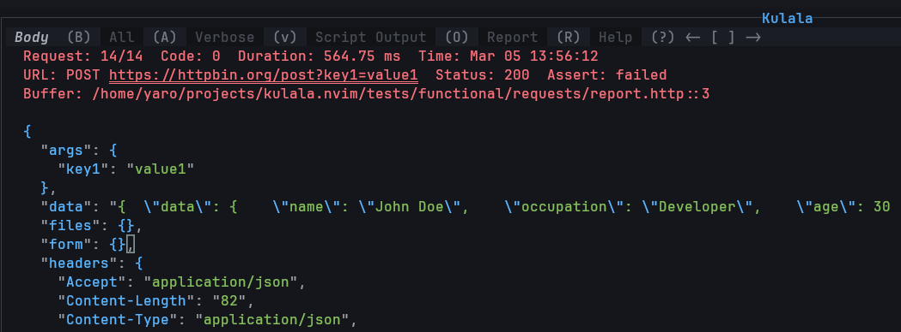

# Basic Usage

## Basic usage summary (with default keymaps)

### Execute request

There are several ways to execute a request:

- Position the cursor on the line of the request or in the block of the request delimited by `###` and then press `<CR>` or `<leader>Rs` to run the request.
- Select several requests in visual mode and press `<CR>` or `<leader>Ra` to run the requests.
- Press `<leader>Ra` to run all requests in the buffer.
- Press `<C-c>` to cancel request execution.
- To search for a request in the buffer, press `<leader>Rf`.
- You can use `#` or `//` to comment out a request or its data, and it will not be processed.

### Executing requests in non `.http` files

- You can execute requests from any file type.  If you wrap your requests in a code block with ````http .. ````, it will behave just like in a `.http` file.
- Common comment syntax is recognized, so you can put requests in the comments of your code files.

If you cannot wrap requests in a code block, you will need to position the cursor exactly on the line with the request or visually select the required 
requests and their accompanying data.

```js
// You javascript code here
console.log('Hello world!');

/* My test request

```http
POST http://localhost:3000
Content-Type: application/json
{"name": "John Doe"}

```

### Kulala UI



- Kulala UI is opened automatically when you run a request or you can open it manually with `<leader>Ro` at any time.
- You can switch between different views with `(H) Headers`, `B (Body)`, `(A) All`, `(V) Verbose`, `(S) Stats`, `(O) Script output`, `(R) Report`
- To scroll through the history of responses use `[` and `]`.
- To clear responses history press `X`.
- To jump to the request in the request buffer press `<CR>`.
- To open help window press `?`.
- To open the Kulala scratch buffer use `<leader>Rb`.
- To choose variables environment use `<leader>Re` and select the environment you want to use.
- To manage Authentication configurations use `<leader>Ru`.

### Kulala LSP and Formatter

Kulala includes a built-in in-process LSP server that provides the following features:

- Autocompletion: HTTP syntax, metadata, commands, variables, requests, GraphQL schema and Kulala API.
- Symbols information: symbols search and symbols outline - `<leader>cs`, `<leader>cS`.
- Hover information for requests: equivalent to Kulala's inspect command - `K`.
- Code actions: a list of all available Kulala commands - `gra/<leader>ca`.
- Formatting: format buffer/range - `gq/<leader>cf/<leader>lf`. 
- Folding

- In `json/yaml/bruno` files, code actions will be available to convert collections into HTTP format.

:::info

Kulala LSP does not set any keymaps, but relies on your Neovim's default LSP keymaps. Some distributions set these keymaps only for LSPs that have been
setup through `nvim-lspconfig` or the distributions's own LSP config. In this case, you may need to enable them yourself. 

Please refer to [keymaps](../getting-started/keymaps.md) for more information.

Some plugins, like `lsp-saga` or `nvim-lighbulb` show :bulb: signs when there are code actions available.

Since Kulala provides code actions for every line, you may want to disable them in your config.
For example:

```lua
require('lspsaga').setup({
  lightbulb = { ignore = { clients = { 'kulala' } } }
})

require("nvim-lightbulb").setup({
 ignore = { clients = { "kulala" } }
})
```

:::

### Syntax summary

- `#` and `//` is used to comment out a request or its data.
- `###` is used to delimit requests and their data.
- `### Request name` is used to name a request, for UI, `import` / `run` commands and to reference the request data in other requests.

#### Metadata

- `# @meta-name meta-value` is used to add arbitrary metadata to a request or file.
- `# @prompt variable-name prompt-string` is used to prompt the user for input and store it in a variable.
- `# @secret variable-name prompt-string` same as `@prompt`, but the input is hidden (useful for passwords).

#### Directives

- `# @accept chunked` allows you to accept Transfer-Encoding: chunked responses and streamed responses.
- `# @curl-...` allows you to set flags for curl requests.
- `# @grpc-...` allows you to set flags for gRPC requests.
- `# @stdin-cmd-pre` allows you to execute an external command before the request is sent.
- `# @stdin-cmd` allows you to execute an external command
- `# @jq` allows you to filter the response body using jq.
- `# @delay` allows you to set a delay (in milliseconds) before sending the request.

#### Variables

- `@variable-name=variable-value` is used to define variables that can be used in request URL, headers and body.
- `{{variable}}` allows you to use variables defined in `metadata`, `system environment` variables, `http-client.env.json` file or `.env` file.
- `{{$dynamic-variable}}` allows you to use predefined dynamic, aka `magic` variables.
- `# @env-stdin-cmd-pre` allows you to set environment variables using an external command, before the request is sent.
- `# @env-stdin-cmd` allows you to set environment variables using an external command.
- `# @env-json-key` allows you to set environment variables using a JSON path on the response body.
- `# @env-header-key` allows you to set environment variables from the response headers.

#### Requests import

- `import /path/to/file` allows you to import requests from another file.
- `run #request-name` allows you to run a named request.
- `run /path/to/file` allows you to run all requests in another file.

#### File input/output

- `< /path/to/file` allows you to include the contents of a file in the request.
- `>> /path/to/file` allows you to save the response to a file. Use `>>!` to overwrite the file if it exists.

#### Scripts

- `< ` and `< {% -- lua }` allow you to run an inline `pre-request` `js|lua` scripts.
- `< /path/to/script.js|lua` allows you to run a `pre-request` `js|lua` script in a file.
- `> ` and `> ` allows you to run an inline `post-request` `js|lua` script.
- `> /path/to/script.js|lua` allows you to run a `post-request` `js|lua` script in a file.

For details please consult the corresponding sections in the documentation.
