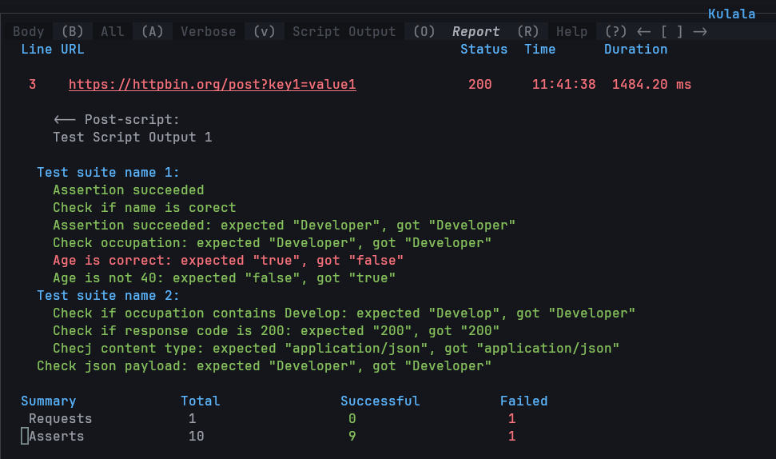

# Testing and Reporting

- You can effectively use Kulala to produce, run and report tests for your APIs, using HTTP spec files and built-in assert functions.

## Usage

Test and assertion cases can be written in either `Lua` or `Javascript` scripts. The API is the same except for some snake case vs camelCase differences.
Check the [Lua scripts](../scripts/lua-scripts.md) for more details.

:::warning

[Node.js](https://nodejs.org) must be installed on your system to run `Javascript` scripts.

:::

### Testing HTTP Requests with Assert Functions

To test HTTP requests in Kulala, you can use the provided assert functions to validate various aspects of the response. Below is a guide on how to use these functions effectively.

1. **Define Your Test Suite and Test Cases**: Use `client.test` to define a test suite and individual test cases within it.

2. **Assert Functions**:

```javascript
  assert(value, message?) // Checks if the value is truthy.
  assert.true(value, message?) // Checks if the value is true.
  assert.false(value, message?) // Checks if the value is false.
  assert.same(value, expected, message?) // Checks if the value is the same as the expected value.
  assert.hasString(value, expected, message?) // Checks if the string contains the expected substring.
  assert.responseHas(key, expected, message?) // Checks if the response has the expected key with the expected value.
  assert.headersHas(key, expected, message?) // Checks if the response headers have the expected key with the expected value.
  assert.bodyHas(expected, message?) // Checks if the response body contains the expected string.
  assert.jsonHas(key, expected, message?)` // Checks if the JSON response has the expected key with the expected value.
```

:::note

- All assert functions are aliases of `client.assert` function.
- The `message` parameter is optional and can be used to provide a custom message for the assertion.
- The `key` for `assert.responseHas` and `assert.jsonHas` can specify nested keys using dot notation (e.g., `data.name`).

:::

3. **Example**:

```http
@OCCUPATION = Developer
POST https://httpbin.org/post?key1=value1 HTTP/1.1
accept: application/json
content-type: application/json

{
  "data": {
    "name": "John Doe",
    "occupation": "{{OCCUPATION}}",
    "age": 30
  }
}

> {%
  let json = response.body.json.data;

  client.test("Test suite name 1", function() {
    assert(json.name == "John Doe")
    assert(json.name == "John Doe", "Check if name is correct")

    assert.same(json.occupation, "Developer")
    assert.same(json.occupation, "Developer", "Check occupation")

    client.assert.true(json.age == 30, "Age is correct")
    client.assert.false(json.age == 40, "Age is not 40")
  });

  client.log("Test Script Output 1")

  client.test("Test suite name 2", function() {
    assert.hasString(json.occupation, "Develop", "Check if occupation contains Develop")
    assert.responseHas('responseCode', 200, "Check if response code is 200")
    assert.responseHas('status', 200, "Check if response status is 200")
    assert.headersHas('Content-Type', "application/json", "Check content type")
  });
  assert.jsonHas("json.data.occupation", "Developer", "Check json payload")
%}
```

### Reporting Results

After executing requests, you can view reports in the Kulala `Report (R)` section.  
When the cursor is on the line of request summary, you can press `<CR>` to jump to the corresponding response output.



#### Reporting Options

Kulala provides comprehensive reporting options to help you analyze the results of your HTTP requests and test assertions.

```lua 
  {
    halt_on_error = false,
    show_request_summary = true,
    disable_script_print_output = false,

    ui = {
      report = {
        -- possible values: true | false | "on_error"
        show_script_output = true,
        -- possible values: true | false | "on_error" | "failed_only"
        show_asserts_output = true,
        -- possible values: true | false
        show_summary = true,
      }
    }
  }
```

- `halt_on_error` - allows to halt/continue running a sequence of requests when a failure is encountered.
- `show_request_summary` - shows/hides request summary at the top of the output window
- `disable_script_print_output` - disables/enables notifications of the script output
- `ui.report.show_script_output` - shows/hides the script output.  `on_error` will show the output only when request status is failed.
- `ui.report.show_asserts_output` - shows/hides the assert output. `on_error` will show the output only when request status is failed, `failed_only` will show only the failed asserts.
- `ui.report.show_summary` - shows/hides the summary of the test results.
